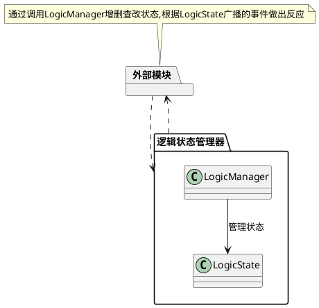

# LogicState文档

```plantuml
@startuml
allowmixing


package 外部模块
package 逻辑状态管理器
{
    class LogicManager
    class LogicState
}

note top of 外部模块:通过调用LogicManager增删查改状态,根据LogicState广播的事件做出反应
外部模块 ..> 逻辑状态管理器
外部模块 <.. 逻辑状态管理器
LogicManager --> LogicState:管理状态
@enduml
```