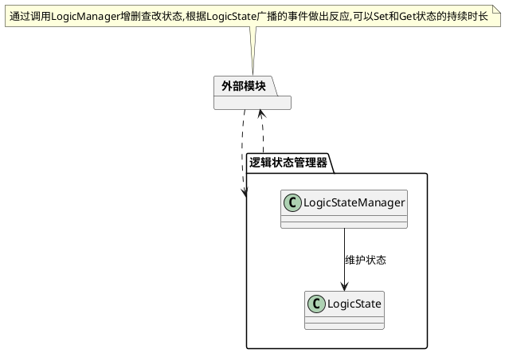

# LogicState文档
## 用途
用于角色的逻辑状态管理,支持维护多重状态、持续时间管理、Buff管理
## 架构图

## 用法案例
[LogicState_Example](./LogicStateSubclass/LogicState_Example.cs)

## 原理讲解
LogicStateManager中使用了字典维护每个逻辑状态，键为状态枚举，值为状态实例。
所有的状态都继承自LogicState，其提供了以下主要函数，其调用顺序、时序关系请看[LogicState](./LogicState.cs)

最佳实践请阅读以下源码：

[LogicState_Example](./LogicStateSubclass/LogicState_Example.cs)

[LogicState_Damaged](./LogicStateSubclass/LogicState_Damaged.cs)
