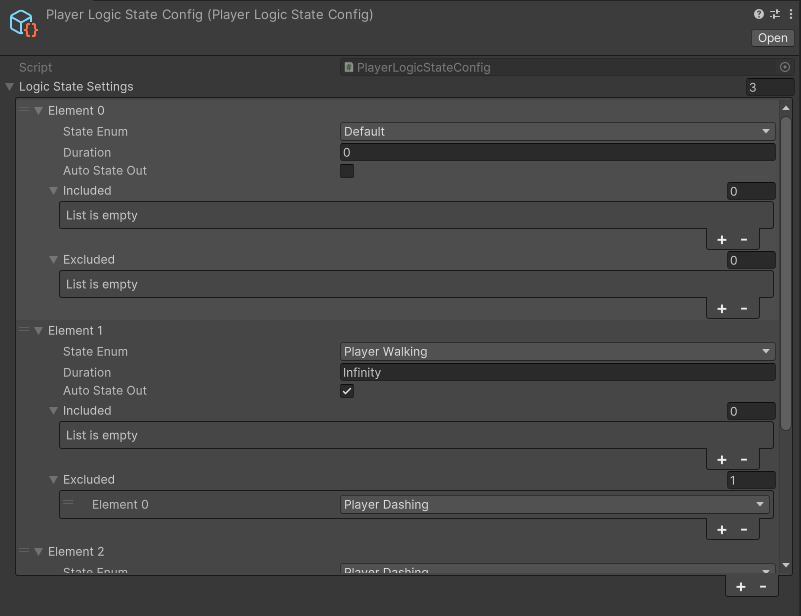
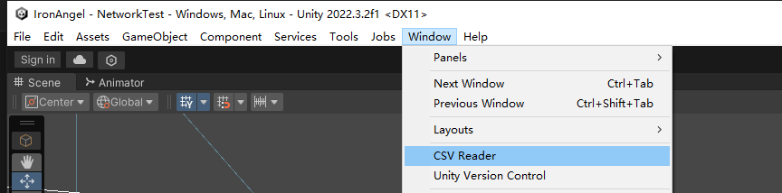
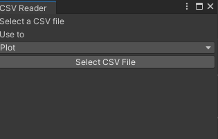
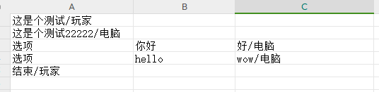
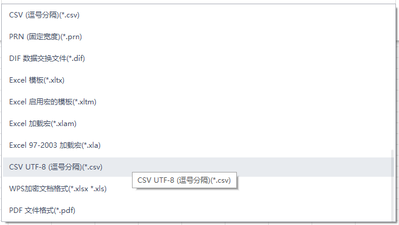

# 铁骑黑天使
## 快速启动项目
### 安装依赖
- Unity 2022.3.2.9740
- Github Desktop
- Visual Studio Code 并安装插件以下插件:
```
C#
C# Dev Kit
IntelliCode for C# Dev Kit
C# XML Documentation Comments
(安装完以上C#相关插件后，使用插件自带的功能安装.Net8和.Net Framework4.7.1，不要跑网上乱下)
Unity
Markdown Preview Enhanced
PlantUML
PDF Preview
Bookmarks
```
### 启动！
双击`open_unity.bat`

### 新场景的相机设置
- 在```Prefabs/Global```文件夹下有```CameraTarget,MainCamera,VirtualCamera```三个相机相关的预制体，将三个预制体拖入场景（需要确保场景中这三种预制体实例有且仅有一个, 尤其注意主相机只能由一个，不然会抢夺最终画面渲染权），然后将```CameraTarget```拖给```VirtualCamera```的```CinemachineVirtualCamera```组件下的```Follow```
- 如果觉得相机的缓动移动太快的话，可以设置```VirtualCamera```的```CinemachineVirtualCamera```组件下的```Body```下的```X Damping```和```Y Damping```,这两个参数是XY轴的移动缓动系数，目前设置为0
- 相机的画面大小设置在```VirtualCamera```的```CinemachineVirtualCamera```组件下```Lens```下的```Ortho Size```设置数值，目前数值为10


### 支持多重逻辑状态管理的LogicStateManager使用说明
假设你需要新增一个状态，名为PlayerMoving,当玩家正在位移时就会添加这个状态，玩家禁止时移除这个状态。
那么你需要找程序员在ELogicState中添加这个枚举，并且在LogicStatesSettings的列表LogicStateTemplates中添加这个状态的生成模板对象。
然后策划在Assets/Config目录中找到对应的配置，并且设置它。

- 其中，状态只会在满足LogicStateManager中有included列表中定义的状态，且没有exincluded列表中的状态时，才能存在。当AutoStateOut选项打勾时，如果运行时不满足这一容斥条件了，这个状态就会被自动移除，AutoStateOut未打勾时，不会自动退出。
- 每个状态默认持续时间为无限时长，由程序员在逻辑中移除这个状态，如果状态存在的时间超过了这个设置，也会被自动移除。设置Duration时，输入inf并回车，会被自动补全为infinity，无限持续时长。


### CSV转对话SO数据工具


- 注意CSV文件的编写格式

- 第一列是普通对话的语句，格式为```语句内容/讲话者名字```
- 第一列使用```选项```字符标识这一行是上一个普通对话的选项，选项标识同一行的第二列是这个选项的文本，同一行第三列开始是这个选项之后的独有普通对话
- 选项标识的下一行的普通对话表示选项独有对话结束后回到的主线对话内容
- 暂时不支持选项里套选项的写法，不过可以在Unity里直接配实现

- 注意CSV导出的格式是utf-8的CSV，同时保存的位置不要在C盘，会没有读取权限
