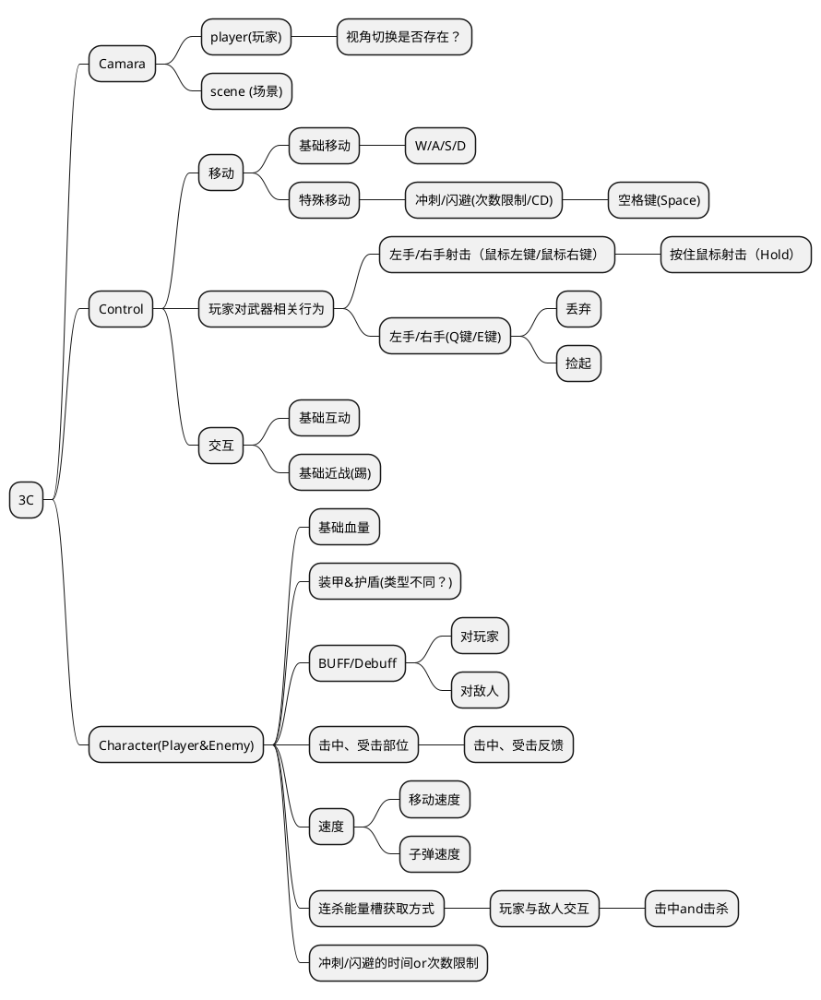
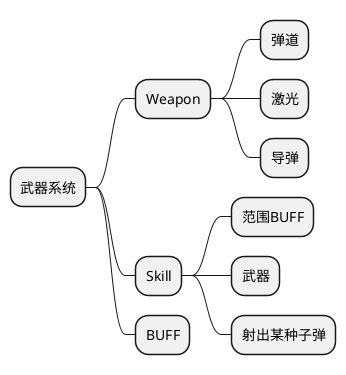
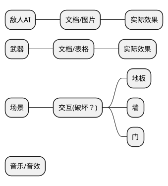

# 策划案
## 第一周工作目标（必须完成！！！）
4种不同类型小兵
4种不同类型武器
3个不同样式的关卡
1个TEST ROOM
交互物品：破坏

### 待评估想法
UI设计（可选）
NPC头顶文字框（可选）
按键改绑（可选）
关卡选择分支（可选，框架优先）

## 工作分配管理
#### 程序
李进文：敌人AI
陈誉：角色3C
程叶飞：武器、技能、BUFF
周琪炫（极光）：文案，世界观整理
刘祎：角色、敌人状态表、UI
杨逸天（魔芋）：武器表

#### 目前的项目框架图

#### 武器系统相关

#### 细节相关

## 策划目前工作相关
### 游戏各项模块
#### 武器系统(负责人：杨逸天（魔芋）)

#### 状态系统（负责人：刘祎）

#### 文案设定（含世界观整理）（负责人：周琪炫（极光））