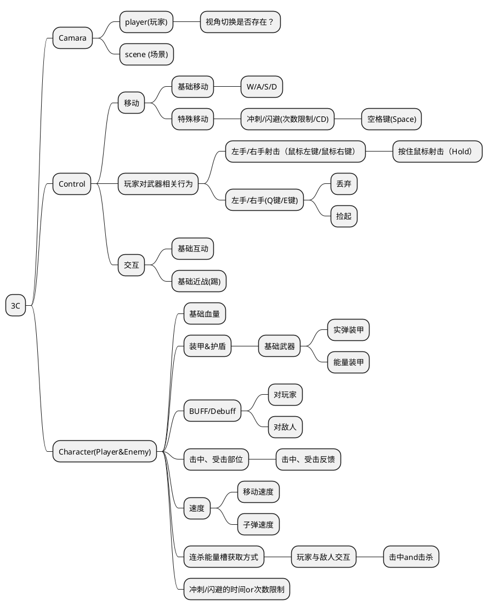
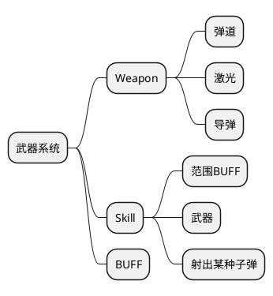
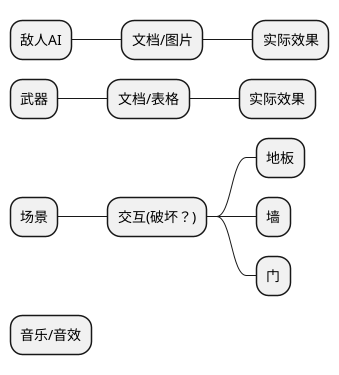

# 策划案
(当前版本由杨逸天撰写 7/29）
## 第一周工作目标（必须完成！！！）
4种不同类型小兵
4种不同类型武器
3个不同样式的关卡
1个TEST ROOM
交互物品：破坏

### 待评估想法
UI设计（可选）
NPC头顶文字框（可选）
按键改绑（可选）
关卡选择分支（可选，框架优先）

## 工作分配管理
#### 程序
李进文：敌人AI
陈誉：角色3C
程叶飞：武器、技能、BUFF
周琪炫（极光）：文案，世界观整理
刘祎：角色、敌人状态表、UI
杨逸天（魔芋）：武器表

#### 目前的项目框架图

#### 武器系统相关

#### 细节相关

## 策划目前工作相关
### 游戏各项模块
#### 武器系统(负责人：杨逸天（魔芋）)
##### 弹道类武器
名称 | 弹药种类 | 发射种类 | 武器血量|射程（距离） | 子弹偏移量（以角色面向方向直线对半分割） |弹药数量（颗）| 单发伤害 | 发射间隔(秒) | 状态(BUFF)|
------- | ------- | ------- | ------ |------ | ------ | ------ | ------ | ------ | ------ |
单发狙击枪|实弹|单发|800|远|0°|10|200|1|暂无|
三连发冲锋枪|实弹|三连发|500|中|6°|50|20*3|0.2|
全自动机枪|实弹|全自动|1000|中|15°|100|5|0|
霰弹枪|实弹|扩散随机式|2000|近(重点)|90°|20|20*10|0.8|
三重式狙击枪|实弹|单发/固定扩散式(三重式狙击枪)|800| 远 |单发偏移量为0°|10|200*3|1|
三重式冲锋枪|实弹|三连发/固定扩散式|500|中|每次发射的单方向子弹偏移量为6°|50|20*3*3|0.2|
三重式机枪|实弹|全自动/固定扩散式|1000|中|每次发射的单方向子弹偏移量为15°|100|5*3|0|

##### 激光类武器
名称 | 弹药种类 | 发射种类 | 武器血量|射程（距离） |弹药每秒消耗量|弹药数量（颗）| 每秒伤害 |  状态(BUFF)|
------- | ------- | ------- | ------ |------ | ------ | ------ | ------ | ------ | 
激光枪|激光|持续|800|远|10/秒|200|50|暂无|

##### 溅射类武器

#### 状态系统（负责人：刘祎）

#### 文案设定（含世界观整理）（负责人：周琪炫（极光））